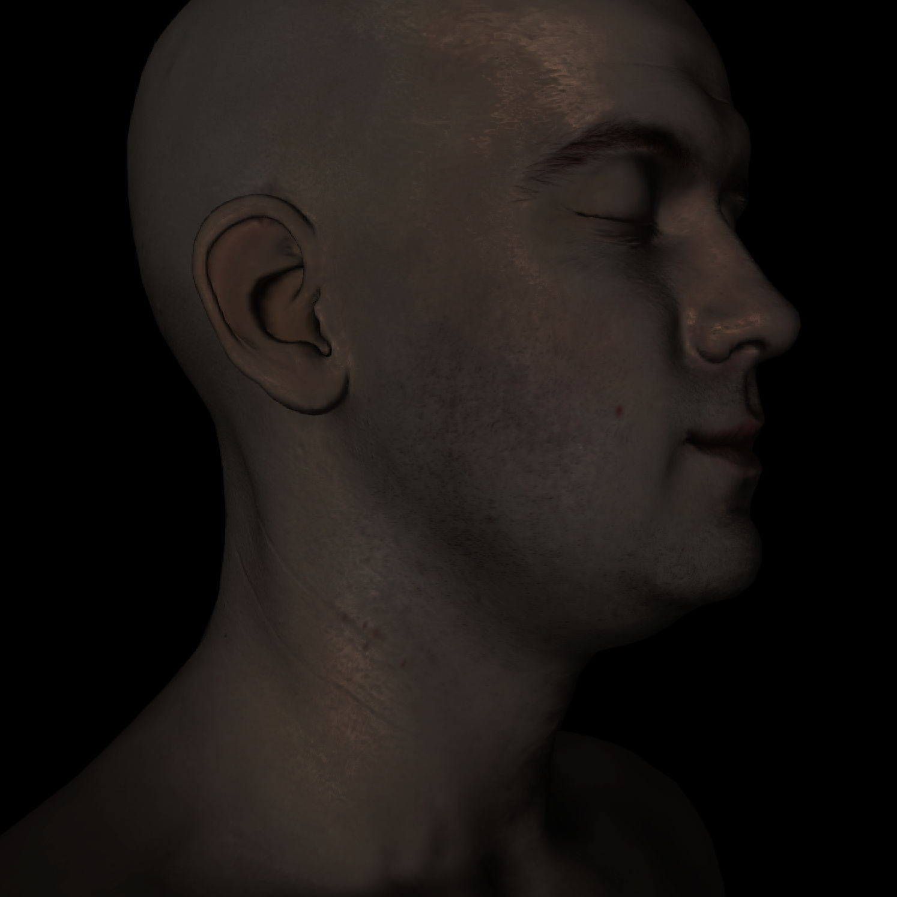
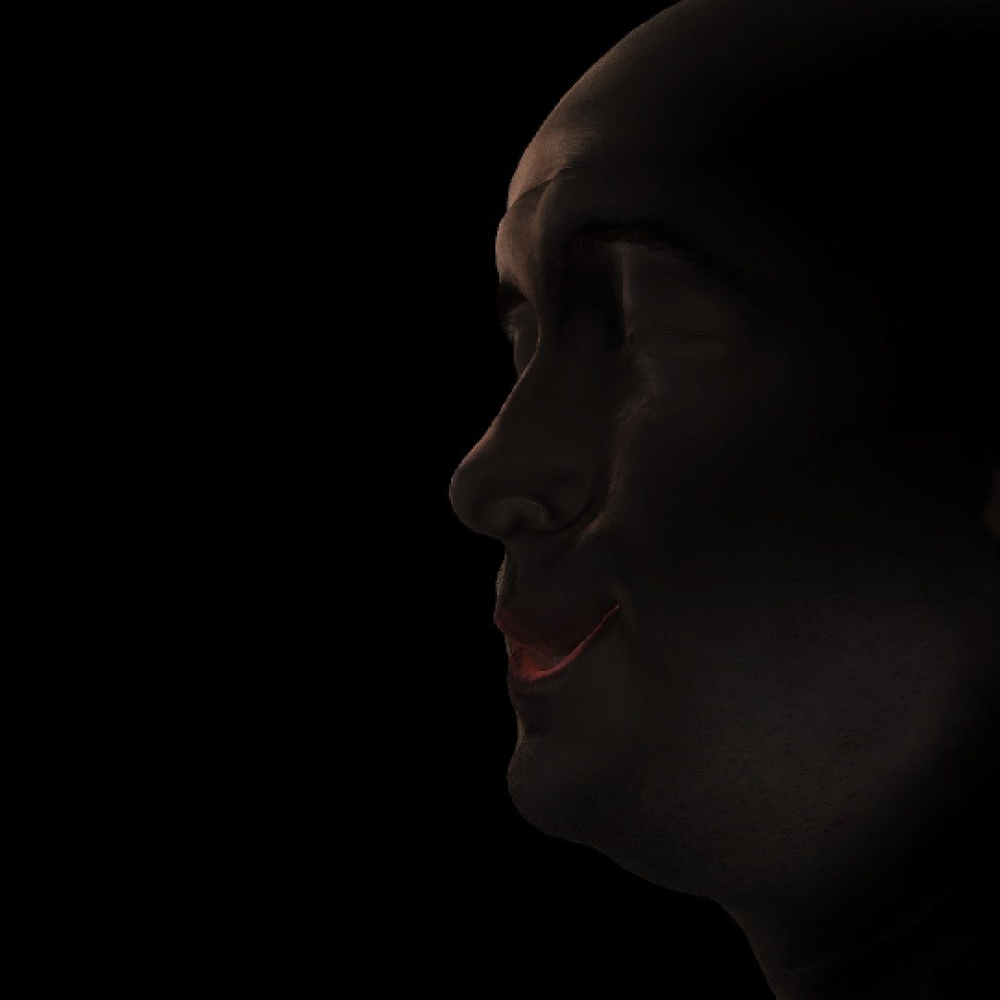

**
Local Deformable Precomputed Radiance Transfer
**

(Note: all photos are taken from the project and run at approximately
40FPS)

**
Motivation
**

Local Deformable Precomputed Radiance Transfer (LDPRT) is a method
proposed by Microsoft in 2005 to compensate for the common problems with
its predecessor: Precomputed Radiance Transfer (PRT). PRTs permit an
application to represent diffuse lighting phenomena such as shadows,
interreflections, and subsurface scattering as a set of constants. The
constants are calculated though an offline simulation via methods
similar to that of a raytracer. To accomplish this feat, PRTs represent
data in the scene using Spherical Harmonics. Because Spherical Harmonics
form the basis of SO(3) (3D rotation group), information for how
lighting interacts at arbitrary light angles can be stored within them.
Once the constants are produced, models can be rendered in real-time
with global illumination effects. These effects are consistent for all
camera positions given the light source is infinitely far away from the
scene. The direction of the incoming light is input into the PRT at
runtime and vertex colors taking into account global illumination are
returned. Unfortunately, PRTs only work for static scenes as when a
vertex position changes, the PRT lighting model fails. LDPRTs seek to
compensate for PRTs Achilles heel by using a Zonal Harmonic basis. Thus,
an LDPRT can quickly rotate a rest coordinate frame to its current
deformed orientation. LDPRTs work best for limited motion such as facial
expressions as they do not fully model global illumination for the
rotated frame.

**
Morph Targeting
**

Morph Targeting is an alternative to Skeletal Animation.  Morph Targeting allows for an artist to move vertices on a model to a desired position in order to more effectively create the ideal pose.  Once all poses / morphs are made by the artist, a base position (a chosen pose) is established.  To animate the figure, the artist interpolates between the difference between the morph vertex's position and that of the base.  Morph Targets are primarily used in facial animation to give the artist complete control over how a character looks.  Since the process is cumbersome and animations are not as smooth as those produced by Skeletal Animation, Morph Targeting still remains limited to expression.  However, because facial expressions do not require large vertex changes, LDPRT works perfectly for Morph Targeting.

Left side is the Base Position (no morph applied); Right side is a Morph Target that drastically alters vertex positions:

**
Wrinkle Model
**

A wrinkle model was also implemented to alter normals based on the
difference in primitive area between the rest and deformed frame.
Normals are created by linlearly interpolating between deformed frame
normals and bump map normal. The result is that deforming skin leads to
darker wrinkles. To increase the prominence of wrinkles and small
details, the mesh is tessellated with a displacement map applied to it.
A displacement map and bump map are both utilized because the
displacement map operates at a coarser grain than the bump map, leading
to a good mix of detail at interactive framerates.

**
Optimization of Lobe Axis
**

Using Zonal Harmonics, LDPRTs estimate PRT lighting with a BFGS to
minimize error between the two models. Although Zonal Harmonics can have
multiple lobe axis, one is chosen for this project to reduce the amount
of data needing to be transferred to the GPU. Zonal Harmonics require a
lobe axis for rotation which, in most cases, is the same as the normal.
Hence, after the BFGS is completed, model normals are replaced with the
direction of Zonal Harmonic lobe axis.  Since the BFGS algorithm needs the
gradient of the objective variables, Mathematica was used to compute the
gradient of a l=0,...,5 Spherical Harmonic.

(approximately .01 difference for single lobe which is not noticeable)

**
Soft shadows
**

To compute a PRT, several samples are taken for light sources scattered around a sphere
that has an infinite radius.  Since the light source is infinitely far away, a ray can
be cast from every vertex on the mesh towards the light source to see if it is blocked.  
Thus, for each sample light source, one ray is produced for every vertex per sample.  
Because this is similar to Monte Carlo integration in a ray tracer for soft shadows,
soft shadows are obtained with no additional cost to what the PRT would already have
to do to light the scene.

**
Interreflections
**

The results from the soft shadow PRT yield the amount of energy present
at each vertex in the scene. To preform radiosity, all surfaces are
assumed to be lambertian reflectors. After going through a set number of
bounces, it is assumed that the results converges. The below scene
demonstrates interreflections in the infamous Cornell Box. The green and
red color of the walls “bleed” onto the white boxes in the scene.

Left side is green color bleed; Right side is red color bleed:

**
Subsurface Scattering
**

For subsurface scattering, the random walk algorithm is implemented. By
choosing several randomly generated paths, the subsurface scattering of
skin is approximated. After moving a set distance, the path is randomly
rotated by a certain number of degrees before proceeding. Hence,
subsurface scattering is implemented via monte carlo integration.

Note how the area below the cheek is lit although the light
source is on the other side of the model.

