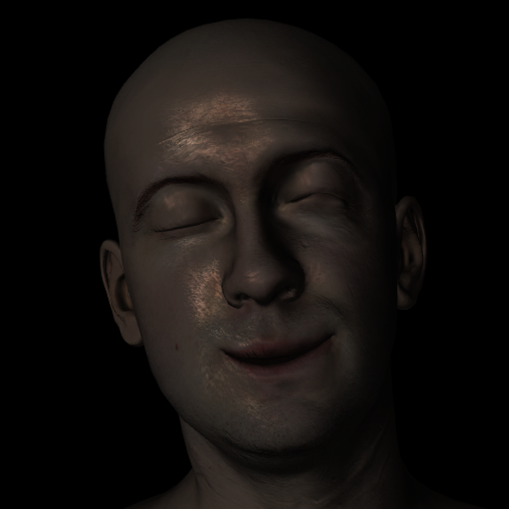

Local Deformable Precomputed Radiance Transfer

(Note: all photos are taken from the project and run at approximately
40FPS)

Motivation:

Local Deformable Precomputed Radiance Transfer (LDPRT) is a method
proposed by Microsoft in 2005 to compensate for the common problems with
its predecessor: Precomputed Radiance Transfer (PRT). PRTs permit an
application to represent diffuse lighting phenomena such as shadows,
interreflections, and subsurface scattering as a set of constants. The
constants are calculated though an offline simulation via methods
similar to that of a raytracer. To accomplish this feat, PRTs represent
data in the scene using Spherical Harmonics. Because Spherical Harmonics
form the basis of SO(3) (3D rotation group), information for how
lighting interacts at arbitrary light angles can be stored within them.
Once the constants are produced, models can be rendered in real-time
with global illumination effects. These effects are consistent for all
camera positions given the light source is infinitely far away from the
scene. The direction of the incoming light is input into the PRT at
runtime and vertex colors taking into account global illumination are
returned. Unfortunately, PRTs only work for static scenes as when a
vertex position changes, the PRT lighting model fails. LDPRTs seek to
compensate for PRTs Achilles heel by using a Zonal Harmonic basis. Thus,
an LDPRT can quickly rotate a rest coordinate frame to its current
deformed orientation. LDPRTs work best for limited motion such as facial
expressions as they do not fully model global illumination for the
rotated frame.

Morph Targeting

Example Facial Expression:

Wrinkle Model:

A wrinkle model was also implemented to alter normals based on the
difference in primitive area between the rest and deformed frame.
Normals are created by linlearly interpolating between deformed frame
normals and bump map normal. The result is that deforming skin leads to
darker wrinkles. To increase the prominence of wrinkles and small
details, the mesh is tessellated with a displacement map applied to it.
A displacement map and bump map are both utilized because the
displacement map operates at a coarser grain than the bump map, leading
to a good mix of detail at interactive framerates.

Optimization of Lobe Axis

Using Zonal Harmonics, LDPRTs estimate PRT lighting with a BFGS to
minimize error between the two models. Although Zonal Harmonics can have
multiple lobe axis, one is chosen for this project to reduce the amount
of data needing to be transferred to the GPU. Zonal Harmonics require a
lobe axis for rotation which, in most cases, is the same as the normal.
Hence, after the BFGS is completed, model normals are replaced with the
direction of Zonal Harmonic lobe axis.

Normals without BFGS and with BFGS

(approximately .01 difference for single lobe which is not noticeable)

Soft shadows

Interreflections

The results from the soft shadow PRT yield the amount of energy present
at each vertex in the scene. To preform radiosity, all surfaces are
assumed to be lambertian reflectors. After going through a set number of
bounces, it is assumed that the results converges. The below scene
demonstrates interreflections in the infamous Cornell Box. The green and
red color of the walls “bleed” onto the white boxes in the scene.

Subsurface Scattering

For subsurface scattering, the random walk algorithm is implemented. By
choosing several randomly generated paths, the subsurface scattering of
skin is approximated. After moving a set distance, the path is randomly
rotated by a certain number of degrees before proceeding. Hence,
subsurface scattering is implemented via monte carlo integration. In the
below image, note how the area below the cheek is lit although the light
source is on the other side of the model. The light

